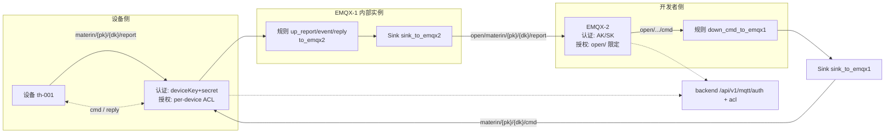
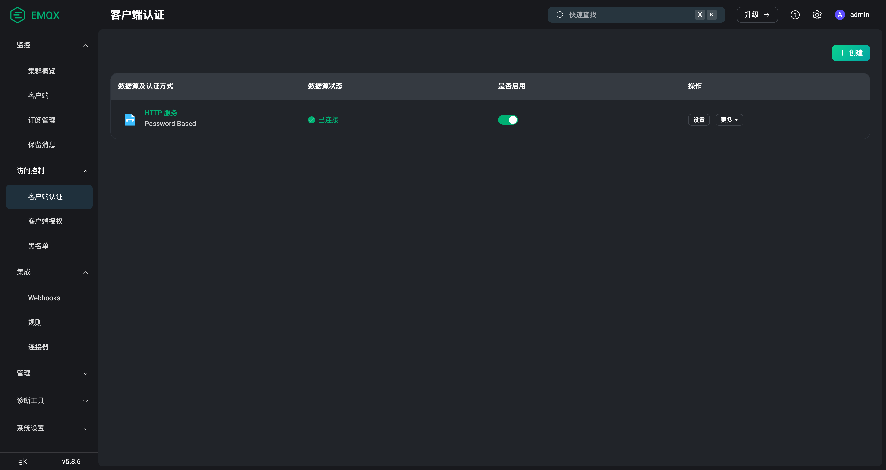
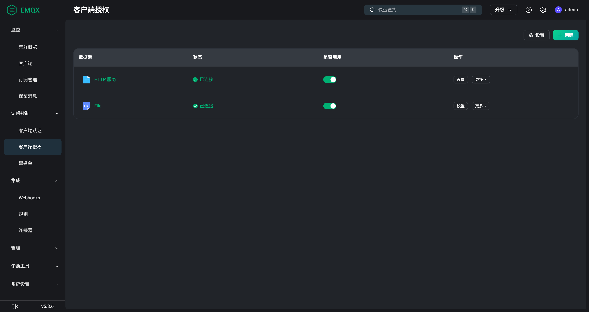
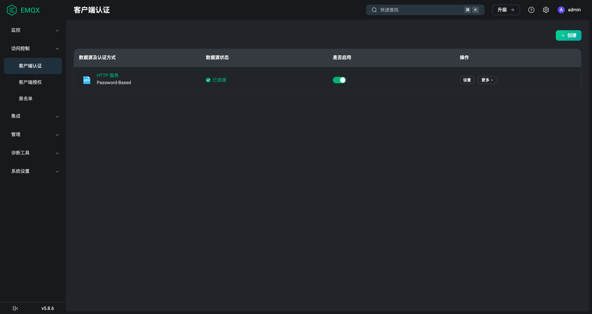
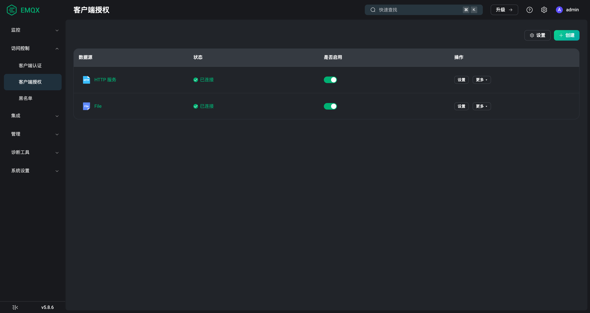
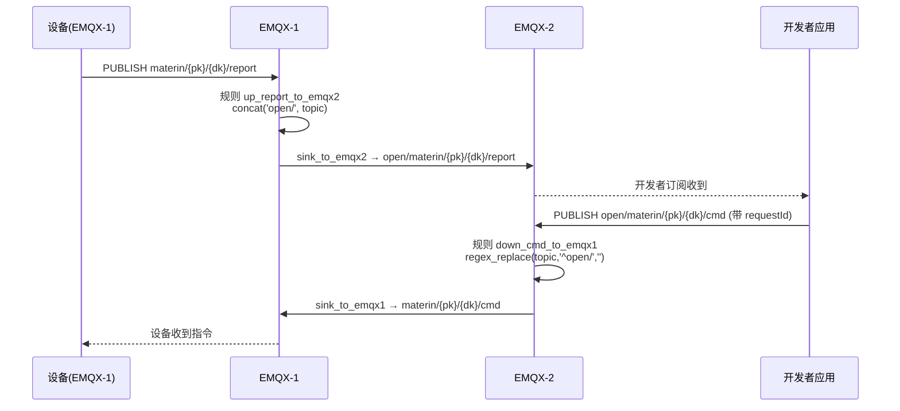
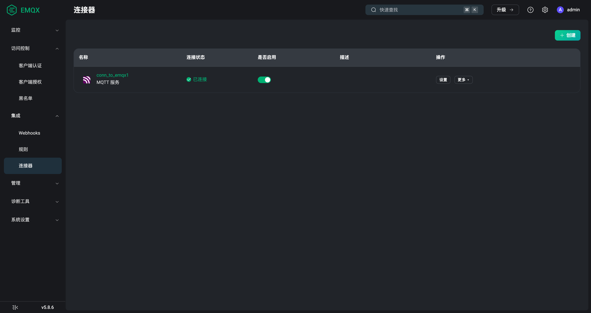
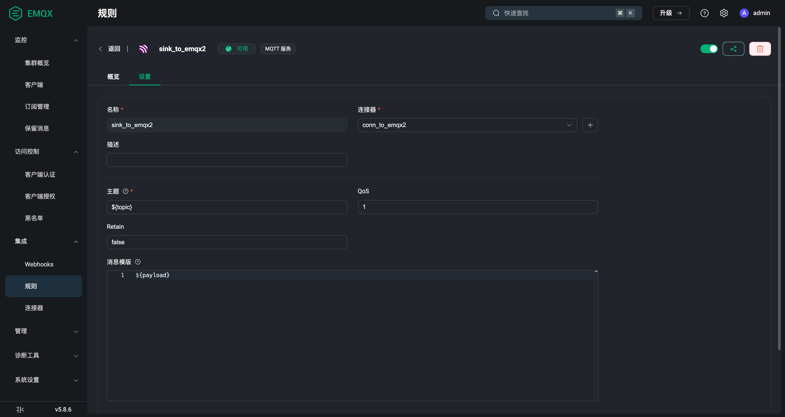
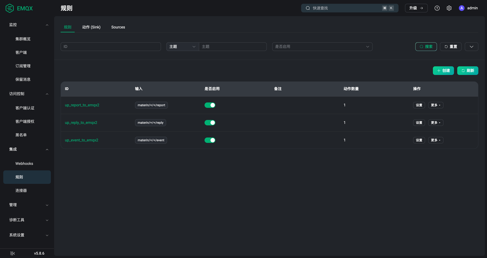
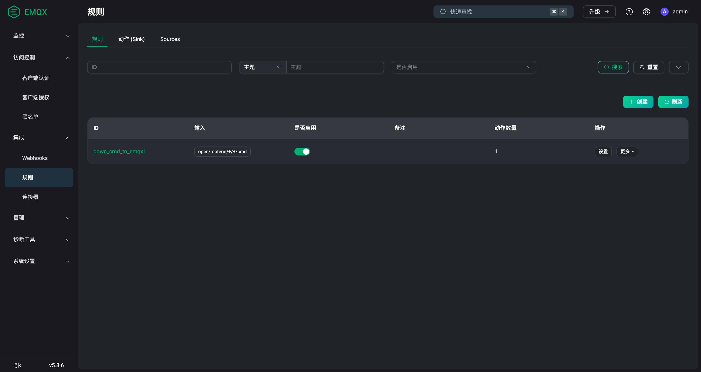

# EMQX 双实例配置手册（图文版）

> 适用版本：EMQX 5.8.6 · 本手册与一键配置脚本 `deploy/compose/emqx-configure.sh` 一一对应，
> 所有配置均可由该脚本幂等重建，也可按本文在管理台手工操作。

## 1. 总体架构

平台部署两个 EMQX 实例，职责隔离：

- **EMQX-1（内部实例）**：设备接入。设备以 `deviceKey + secret` 连接，
  按 per-device ACL 只能访问自己的 Topic。
- **EMQX-2（开发者实例）**：第三方应用接入。应用以 `AK + SK` 连接
  （第二套鉴权逻辑），只能访问 `open/` 命名空间。
- 两实例之间通过 EMQX 集成（规则 Rule + 连接器 Connector + 动作 Sink）
  实现消息互通。



| 实例 | 容器 | 客户端端口 | 管理台 | 鉴权方式 |
|---|---|---|---|---|
| EMQX-1 | materin-emqx | 1883 | http://localhost:18083 | 设备：deviceKey + secret；服务账号：materin-svc-* |
| EMQX-2 | materin-emqx2 | 11883 | http://localhost:18084 | 开发者应用：AK + SK（open 专用回调，设备凭证拒绝） |

## 2. 鉴权与授权（两个实例同构，回调 backend）

两个实例的认证/授权都由 **backend HTTP 回调**实时校验（fail-closed：
backend 不可用时连接被拒）。

### 2.1 EMQX-1 客户端认证

管理台路径：`访问控制 → 客户端认证`



- 类型：`Password-Based` + `HTTP 服务`
- URL：`POST {BACKEND}/api/v1/mqtt/auth`
- Body：`{"username": "${username}", "password": "${password}"}`
- backend 校验逻辑：
  - `materin-svc-*` → 服务账号（密码 = 平台服务密钥）
  - 设备：username=deviceKey，password=device.secret（MySQL 比对）
  - 开发者：username=AK，password=SK（open_app 表比对）
- 返回 `{"result": "allow"|"deny"}`；失败连接被拒（CONNACK 5）

### 2.2 EMQX-1 客户端授权

管理台路径：`访问控制 → 客户端授权`



- 类型：`HTTP 服务`
- URL：`POST {BACKEND}/api/v1/mqtt/acl`
- Body：`{"username","topic","action","clientid"}`
- backend 校验逻辑：
  - 设备：topic 中 deviceKey 必须 == username，productKey 必须是本人所属产品；
    publish 限 `report/event/reply`，subscribe 限 `cmd/...`
  - 开发者（AK）：仅允许 `open/` 前缀
  - 服务账号：放行

### 2.3 EMQX-2 认证与授权（AK/SK 第二套逻辑）




回调 open broker 专用接口，**与 EMQX-1 隔离**：

- 认证：`POST {BACKEND}/api/v1/mqtt/open/auth` —— 仅放行服务账号 + 开发者
  AK/SK（open_app 表）；**设备凭证一律拒绝**（broker 职责隔离，设备只能走
  EMQX-1）。
- 授权：`POST {BACKEND}/api/v1/mqtt/open/acl` —— 服务账号全放行，开发者 AK
  仅限 `open/` 命名空间。
- 判定逻辑：`MqttAccessPolicy.authenticateOpen / authorizeOpen`（单测覆盖
  `MqttAccessPolicyTest`）。

## 3. 消息互通（集成：连接器 + 动作 + 规则）

### 3.1 数据流



### 3.2 连接器（Connector）

管理台路径：`集成 → 连接器`



| 名称 | 所在实例 | 对端 | 凭证 |
|---|---|---|---|
| `conn_to_emqx2` | EMQX-1 | materin-emqx2:1883 | 服务账号 `materin-svc-emqx2-bridge`（过 HTTP 认证） |
| `conn_to_emqx1` | EMQX-2 | materin-emqx:1883 | 服务账号 `materin-svc-emqx2-bridge`（过 HTTP 认证） |

> 等保改造后后端拒绝匿名 MQTT 连接（`MqttAccessPolicy.authenticate` 对空
> username 返回 false），双向桥接统一使用服务账号（ACL 全放行）。

> 5.8 注意：旧 `bridges` API 已不可用（incompatible_bridge_v1），
> 必须用 `POST /api/v5/connectors` + `POST /api/v5/actions`。

### 3.3 动作（Sink）

管理台路径：`集成 → 动作`



两个 MQTT Sink 参数一致：`topic = ${topic}`，`payload = ${payload}`
（注意字段名是 `payload`，不是 `payload_template`）。

### 3.4 规则（Rule）

管理台路径：`集成 → 规则`




| 规则 ID | 实例 | SQL | 动作 |
|---|---|---|---|
| `up_report_to_emqx2` | E1 | `SELECT concat('open/', topic) AS topic, payload FROM "materin/+/+/report"` | mqtt:sink_to_emqx2 |
| `up_event_to_emqx2` | E1 | 同上（event） | mqtt:sink_to_emqx2 |
| `up_reply_to_emqx2` | E1 | 同上（reply） | mqtt:sink_to_emqx2 |
| `down_cmd_to_emqx1` | E2 | `SELECT regex_replace(topic, '^open/', '') AS topic, payload FROM "open/materin/+/+/cmd"` | mqtt:sink_to_emqx1 |

> 踩坑记录：`regex_replace(subject, regex, replacement)` 的 subject 在第一个参数，
> 写反会把 topic 改写成 `^open/`。

## 4. 自动配置（compose 启动即生效）

**`docker compose up -d` 会自动完成 EMQX 全部配置**：`emqx-init` 一次性服务
在 emqx / emqx2 / backend 三者 healthy 后自动运行配置脚本（幂等，已存在的
资源自动跳过），覆盖第 2、3 节的全部资源，结束时打印双实例 Sink 连接状态。
执行日志：`docker logs materin-emqx-init`；失败自动重试 3 次（restart:
on-failure:3）。

也可手工执行同一脚本（宿主机或容器内均可，POSIX sh + curl，无额外依赖）：

```bash
cd deploy/compose
EMQX1_HOST=http://localhost:18083 EMQX2_HOST=http://localhost:18084 \
BACKEND_URL=http://localhost:8080 ./emqx-configure.sh
```

环境变量（均可覆盖）：`EMQX1_HOST` / `EMQX2_HOST` / `EMQX_DASH_USER` /
`EMQX_ADMIN_PASSWORD` / `EMQX2_ADMIN_PASSWORD` /
`MATERIN_MQTT_SERVICE_USERNAME` / `MATERIN_MQTT_SERVICE_PASSWORD` /
`BACKEND_URL`。

> 注意：EMQX 的 `environment` 引导（env 方式声明认证/授权）只在容器首次创建
> 时生效；卷已存在时以卷内配置为准。改动 emqx2 回调地址等 env 后需
> `docker compose rm -sf emqx2 && docker volume rm materin_emqx2-data` 再 up，
> emqx-init 会自动重建其余资源。

## 5. 验证清单

```bash
# 1. 设备上线并上报（应出现在 EMQX-2 的 open/ 主题）
mosquitto_pub -h localhost -p 1883 -u th-001 -P <secret> \
  -t "materin/{pk}/th-001/report" -m '{"temperature":25}'

# 2. 开发者订阅（AK/SK 连 EMQX-2）
mosquitto_sub -h localhost -p 11883 -u <AK> -P <SK> -t "open/materin/+/+/report"

# 3. 开发者下发指令（应到达 EMQX-1 设备）
mosquitto_pub -h localhost -p 11883 -u <AK> -P <SK> \
  -t "open/materin/{pk}/th-001/cmd" -m '{"requestId":"r1","action":"x"}'

# 4. 错误 SK 应被拒（CONNACK 5）
# 5. AK 访问 materin/ 内部命名空间应被 ACL 拒绝
```

## 6. 常见问题排查

| 现象 | 原因与处理 |
|---|---|
| CONNACK 5（Not authorized） | 认证被拒：检查 deviceKey/secret、AK/SK、服务账号密码；或 backend 不可达（fail-closed） |
| 消息发出但对端收不到 | 检查规则 metrics（`集成 → 规则 → 指标`）与 sink 状态；确认 topic 重写正确 |
| topic 变成 `^open/` | regex_replace 参数顺序写反（subject 在前） |
| /api-docs 相关类缺失启动失败 | springdoc 与 knife4j 版本冲突，见 README 版本口径 |
| 下行直通管道暴露 | 生产启用前必须完成 AK/SK 之外的配额限流与审计 |
